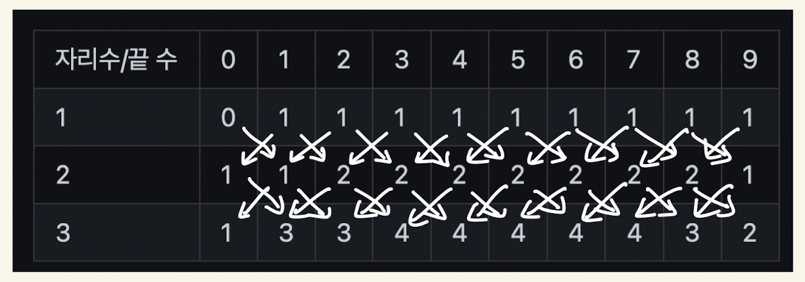

### 유형 : dp
### 윤기범
https://www.acmicpc.net/problem/10844

### 문제 접근 방식
  - 끝나는 수를 열, 자리수를 행으로 하는 표를 그려보았다.
  
  <table>
    <tr>
      <td> 자리수/끝 수 </td>
      <td> 0 </td>
      <td> 1 </td>
      <td> 2 </td>
      <td> 3 </td>
      <td> 4 </td>
      <td> 5 </td>
      <td> 6 </td>
      <td> 7 </td>
      <td> 8 </td>
      <td> 9 </td>
    </tr>
    <tr>
      <td>1</td>
      <td> 0 </td>
      <td> 1 </td>
      <td> 1 </td>
      <td> 1 </td>
      <td> 1 </td>
      <td> 1 </td>
      <td> 1 </td>
      <td> 1 </td>
      <td> 1 </td>
      <td> 1 </td>
   </tr>
   <tr>
      <td>2</td>
     <td> 1 </td>
      <td> 1 </td>
      <td> 2 </td>
      <td> 2 </td>
      <td> 2 </td>
      <td> 2 </td>
      <td> 2 </td>
      <td> 2 </td>
      <td> 2 </td>
      <td> 1 </td>
  </tr>
  <tr>
      <td>3</td>
      <td> 1 </td>
      <td> 3 </td>
      <td> 3 </td>
      <td> 4 </td>
      <td> 4 </td>
      <td> 4 </td>
      <td> 4 </td>
      <td> 4 </td>
      <td> 3 </td>
      <td> 2 </td>
    </tr>
  </table>
  
  - 위의 표를 참조하여 규칙을 찾아보면 다음과 같다.
  
  
  
  - 즉 경우는 다음과 같이 3가지 경우이다.
    - 0으로 끝나는 경우 -> 아래 행의 오른쪽 열에 더함
    - 9로 끝나는 경우 -> 아래 행의 왼쪽 열에 더함
    - 그 외의 경우 -> 아래 행의 좌, 우 열에 더함
     
### 주의할 점
  - 위의 3가지 경우에 모두 % 연산해주기
  - 정답을 합하다 보면 int 오버플로우 가능 따라서 long 형 변수 선언

### 보완해야 할 점
  - 표를 그려서 패턴 파악하기

