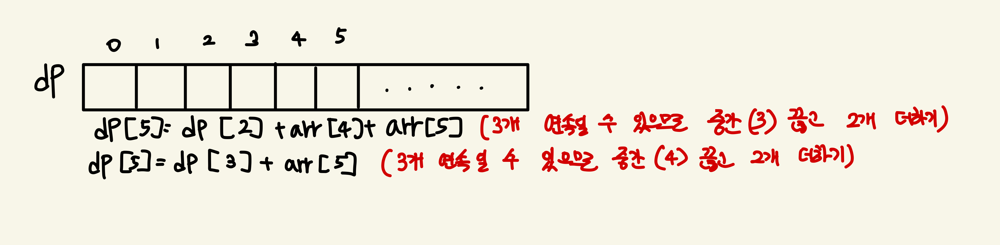

### 유형 : dp
### 윤기범
https://www.acmicpc.net/problem/2579

### 문제 접근 방식
  - 문제를 읽고 dp라 판단함
  - 마지막 칸을 무조건 밟아야 하고 3칸을 연속으로 밟으면 안된다
  - dp배열을 만들면 다음과 같다.
  - dp[0] = arr[0] (dp[0]은 입력받은 배열 arr의 0번째 값과 같다.)
  - dp[1] = arr[0] + arr[1] (dp[1]은 입력받은 배열 arr의 0번째 + 1번째 값과 같다.) - 2개 연속은 가능하다
  - dp[2] = arr[0] + arr[2], arr[1] + arr[2] 중 최대 값 (3개 연속을 할 수 없고 마지막 값은 무조건 포함시켜야 하기 때문이다)
  - ...
  - dp[5] = dp[i-3] + arr[i-1] + arr[i], dp[i-2] + arr[i] 중 최대 값
  
  
### 주의할 점
  - 특별하게 없음

### 보완할 점
  - 특별하게 없음
