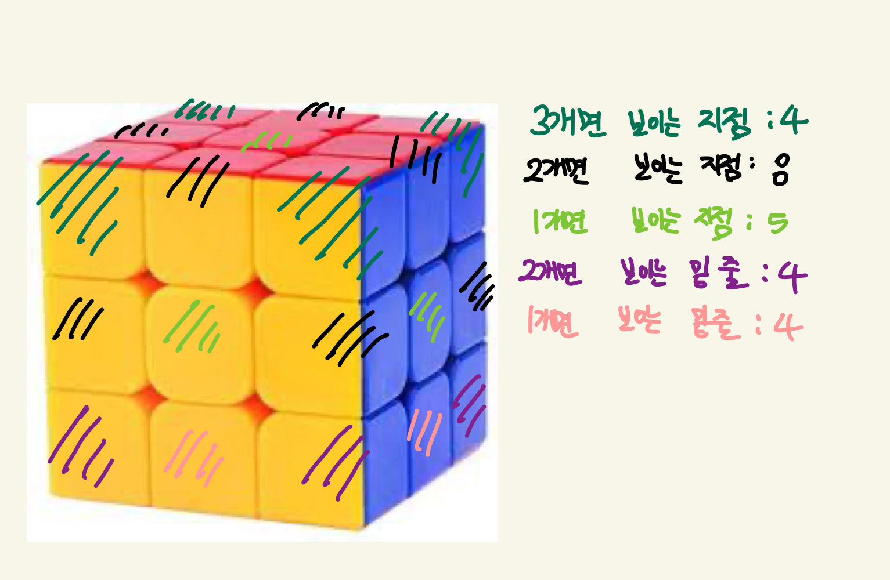

### 유형 : 그리디
### 윤기범
https://www.acmicpc.net/problem/1041

### 문제 접근 방식
  - 문제를 읽고 그리디로 접근함
  - 가장 먼저 n별 어떤 것들이 필요한지 그림을 그려 확인해보기
  - 3*3*3도형을 그리면 다음과 같다.
    
  
  - 위 경우를 일반화 하면 다음과 같다.
    - 3개 면 보이는 윗면 4개 고정
    - 2개 면 보이는 윗면 및 옆면 (n-2)*8개
    - 1개 면 보이는 가운데 면 (n-2) * (n-2) * 5개
    - 2개 면 보이는 밑 면 4개 고정
    - 1개 면 보이는 밑 면 (n-2)*4개
  - 따라서 3개면의 합, 2개면의 합, 1개면 각각의 최소값을 구해야 한다.
  - 문제의 전개도를 기준으로 그리면 다음과 같다.
    - 3개면 가능한 경우
      - ABC
      - ACE
      - BCF
      - CEF
      - AED
      - ABD
      - EDF
      - BDF
    - 2개면 가능한 경우
      - AB
      - AC
      - AD
      - AE
      - BC
      - BD
      - BF
      - CF
      - CE
      - DF
      - DE
      - EF
  - 각각의 경우를 배열로 지정한 후 오름차순 정렬하여 최소값을 찾아낸다.
  - 단 n이 1인 경우 오름차순 하여 앞에서부터 5개의 수를 더한다.
         
### 주의할 점
  - 정수 범위 신경쓰기

### 보완할 점
  - 특별하게 없음
