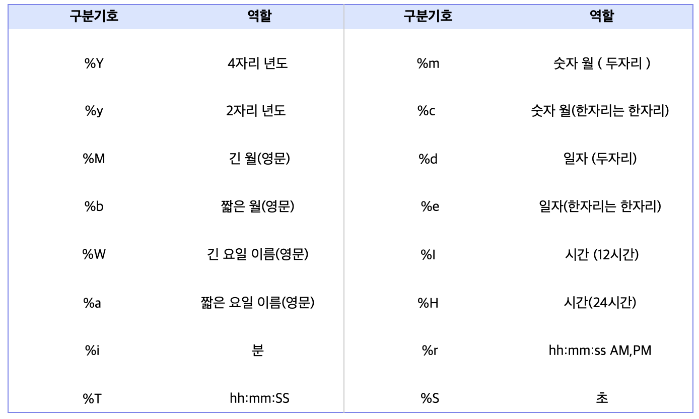

## DATE_FORMAT

### SELECT IFNULL(Column명, "Null일 경우 대체 값") FROM 테이블명; 
  - DATE_FORMAT(날짜 , 형식) : 날짜를 지정한 형식으로 출력
  
<br/>

### 사용 예시
```sql
SELECT IFNULL(Column명, "Null일 경우 대체 값") FROM 테이블명; 
```
